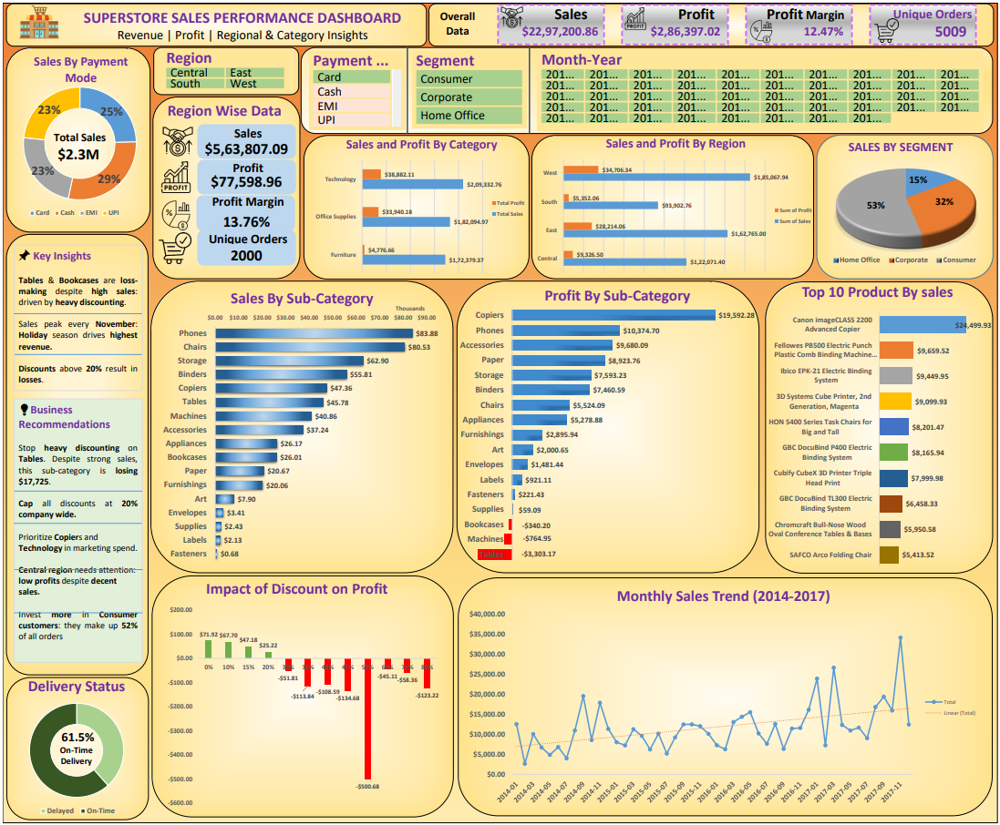

# FUTURE_DS_01
Business Sales Performance Dashboard built using Microsoft Excel  as part of Future Interns Data Analytics Internship

## Dataset
- Source: Kaggle — Sample Superstore Dataset
- Rows: 9,994 transactions
- Period: 2014-2017

## What the Dashboard Includes
- KPI Cards (Total Sales, Profit, Margin, Orders)
- Sales & Profit by Category and Region
- Sales & Profit by Sub-Category (17 categories)
- Monthly Sales Trend (2014-2017)
- Impact of Discount on Profit
- Sales by Segment and Payment Mode
- Delivery Status Tracker
- Top 10 Products by Sales
- Interactive Slicers

## Key Insights
- Tables sub-category loses money despite high sales
- Discounts above 20% result in consistent losses
- West region leads in Sales and Profit
- 38% of orders are delayed
- Technology has the highest profit margin (~17%)

## Tools Used
Microsoft Excel — Pivot Tables, Charts, Slicers, Dashboard Design

## Dashboard Preview

